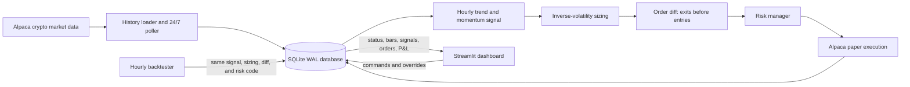

# Northstar Crypto

Northstar Crypto is an end-to-end systematic trading system for FINM 25000. It
uses Alpaca for crypto market data and order routing in **paper trading mode
only**. The project includes a 24/7 data pipeline, an hourly trend strategy,
fractional position sizing, pre-trade and portfolio risk controls, a simulated
backtester, persistent monitoring, and a Streamlit operator dashboard.

> Paper trading only. Never add real credentials to Git. The engine always
> creates `TradingClient(..., paper=True)` and the completed `.env` is ignored.

## Project goal

The goal is not to claim that a simple signal can predict crypto perfectly.
The goal is to demonstrate the architecture and controls required to turn a
repeatable idea into a working trading system:

- Collect and store live Alpaca crypto data.
- Compute the same systematic signal in live and backtest modes.
- Convert target weights into fractional orders.
- Check every order before it reaches the paper broker.
- Track order states, positions, P&L, data freshness, and risk events.
- Give an operator clear start, pause, rebalance, and flatten controls.

Alpaca documents crypto historical/live data through its
[crypto market-data clients](https://alpaca.markets/sdks/python/market_data.html)
and crypto paper orders through the
[standard orders API](https://docs.alpaca.markets/us/docs/crypto-orders).
Crypto market orders support fractional quantities and use `gtc` or `ioc`;
Northstar uses fractional `qty`, market orders, and `gtc`.

## Architecture



Two processes share one SQLite database in WAL mode:

1. `run_engine.py` owns live data, decisions, risk checks, paper orders, and
   account snapshots.
2. `ui/app.py` reads monitoring tables and writes only the `control` table.

This separation keeps the UI responsive without giving it direct broker-order
logic. A dashboard click becomes a database command; the engine validates and
performs it on the next cycle.

### Module boundaries

| Area | Responsibility |
| --- | --- |
| `core/` | Configuration, typed contracts, pair normalization, database schema, logging, retries |
| `data/` | Alpaca crypto history, minute/hour polling, all persistence queries |
| `strategy/` | Pure indicator, ranking, weighting, and fractional sizing functions |
| `risk/` | Stale-data, concentration, exposure, stop-loss, and daily-loss checks |
| `execution/` | Broker-independent interface, Alpaca paper adapter, simulator, order diff |
| `engine/` | 24/7 orchestration and UI control protocol |
| `backtest/` | Hourly no-lookahead event loop and performance metrics |
| `ui/` | Streamlit monitoring and controls |
| `scripts/` | Preflight, backfill, and emergency paper-account flatten tools |
| `tests/` | Offline unit tests and opt-in Alpaca integration checks |

## Strategy

The universe is six liquid USD pairs: `BTC/USD`, `ETH/USD`, `SOL/USD`,
`LINK/USD`, `LTC/USD`, and `AVAX/USD`. Alpaca currently lists these as
supported USD crypto pairs.

For each pair, using only completed hourly bars:

1. Use Bitcoin as a broad risk regime: Bitcoin must be above its seven-day
   average and have more than 1% three-day momentum, otherwise the whole book
   stays in cash.
2. Calculate a 48-hour fast moving average and a 168-hour slow moving average
   for every pair.
3. Require the close to be above the slow average, the fast average to be at
   least 0.5% above the slow average, and three-day momentum to exceed 1%.
4. Rank qualifying pairs by three-day momentum divided by annualized seven-day
   volatility.
5. Hold at most the top two qualifying pairs.
6. Allocate by inverse volatility, with 50% target exposure and a 28% strategy
   cap per coin. The 2% buffer below the hard 30% risk cap absorbs slippage.
7. Rebalance daily, or immediately when requested from the UI.

The intuition is that crypto trends can persist, but altcoins often decline
together when Bitcoin is in a broad downtrend. The Bitcoin regime and each
coin's trend filter avoid automatically buying the least-bad coin in a falling
market. Inverse-volatility sizing keeps one volatile pair from dominating
risk. The tradeoff is lag: moving averages enter late, exit after reversals
begin, and can whipsaw in sideways markets.

All parameters are explicit in [`config/config.yaml`](config/config.yaml).

## Data pipeline

- `CryptoHistoricalDataClient` backfills hourly bars for signals/backtests.
- The poller refreshes `1Min` bars for live prices and `1Hour` bars for signals.
- A multi-symbol REST request is used per timeframe rather than one request per
  coin.
- Bars are upserted by `(symbol, timeframe, timestamp)`, so re-fetching an
  in-progress bar updates it without creating duplicates.
- The strategy excludes the currently forming hourly bar. Live decisions only
  use completed information.
- Every opening order receives the age of its pair's latest minute bar. Unknown
  or older-than-180-second prices are blocked.
- SQLite records bars, signals, orders, positions, equity, control state, and
  risk events for both the engine and UI.

Alpaca market-data responses use pair notation such as `BTC/USD`, while account
positions can use `BTCUSD`. `core/symbols.py` normalizes both forms before any
portfolio or risk comparison.

## Execution and risk

The engine converts target quantities into the difference from current
positions. Exits and reductions execute before new buys, which frees cash and
reduces risk before adding it elsewhere.

Each paper order has a unique `client_order_id`. If an API response is lost,
the adapter looks up that stable ID instead of blindly placing a duplicate.
Orders are stored as `submitted`, then updated to their terminal state such as
`filled`, `canceled`, or `rejected`. Alpaca errors and non-filled states are
logged without stopping the rest of the engine.

Risk controls are applied in this order:

- Never create a short position; this is a long-only spot strategy.
- Never open exposure on missing or stale minute data.
- Ignore opening/rebalancing trades below $5 to reduce dust and churn.
- Limit one order to 30% of equity.
- Limit one coin to 30% of equity after the trade.
- Limit total strategy crypto exposure to 80% of equity.
- Close a position at an 8% unrealized loss.
- Prevent re-entry for six hours after a stop-loss.
- Flatten the configured crypto universe and pause after a 4% UTC-day loss.
- Always allow risk-reducing exits even when normal opening limits are hit.

The kill switch and `scripts/flatten.py` act only on the configured strategy
universe. They do not liquidate unrelated positions in the paper account.

## Backtest

The backtester uses the same `compute_signals -> apply_target_weights ->
target_quantities -> diff_targets -> RiskManager` path as live mode. Only the
execution adapter changes.

- Signals at hour `t` use closes through hour `t-1`.
- Orders fill at hour `t`'s open plus configured slippage.
- Equity marks at hour `t`'s close.
- The simulation includes 10 bps slippage and 15 bps fees by default.
- Stop-losses, cooldowns, exposure caps, and the UTC-day kill switch remain on.
- Metrics include cumulative P&L, return, hourly annualized Sharpe, maximum
  drawdown, fills, closed trades, and hit rate.

This is a historical simulation, not evidence of future profitability. Paper
fills, parameter selection, and omitted market impact can materially overstate
real-world results.

## Setup

Python 3.11 or newer is recommended.

```powershell
cd project_alpaca
python -m venv .venv
.\.venv\Scripts\Activate.ps1
python -m pip install -r requirements.txt
Copy-Item .env.example .env
```

Add **paper-trading** credentials to `.env`:

```text
ALPACA_API_KEY=...
ALPACA_SECRET_KEY=...
```

The loader searches `project_alpaca/.env` and parent repository `.env` files,
so either layout works. Never display `.env` during the video.

## Run

Run the read-only preflight first:

```powershell
python scripts/preflight.py
```

Load history and run a backtest:

```powershell
python scripts/backfill.py --days 180
python run_backtest.py --days 180
```

Start the engine and dashboard in separate terminals:

```powershell
python run_engine.py
```

```powershell
python -m streamlit run ui/app.py
```

The dashboard shows engine connectivity, minute-bar freshness, equity, cash,
crypto exposure, P&L, latest signals, positions, order states, and risk events.
Controls provide Start, Pause, Rebalance Now, editable risk limits, and a
confirmation-guarded kill switch.

Emergency paper-only flatten, even if the UI is unavailable:

```powershell
python scripts/flatten.py
```

## Video demo sequence

1. Run `python scripts/preflight.py` and show only PASS lines.
2. Run `python run_backtest.py --days 180` before recording so the backtest tab
   is populated.
3. Optionally run `python scripts/flatten.py` before recording if the group
   wants the first forced rebalance to create visible opening orders.
4. Start `python run_engine.py`, then open the Streamlit dashboard.
5. Show ONLINE heartbeat and fresh minute bars.
6. Click **Rebalance now** and follow signals to order states and positions.
7. Open Alpaca's dashboard in **Paper Trading** mode and show the matching
   crypto orders/positions.
8. Switch the UI to Backtest and discuss actual displayed results without
   presenting them as guaranteed returns.

The complete narration and screen directions are in [`SCRIPT.md`](SCRIPT.md).

## Tests

Offline suite (never calls Alpaca):

```powershell
python -m pytest
```

Read-only Alpaca account/data checks:

```powershell
python -m pytest -m integration
```

The order round-trip is deliberately opt-in and uses about $5 in paper funds:

```powershell
$env:RUN_ALPACA_ORDER_SMOKE="1"
python -m pytest -m integration -k order_round_trip
```

## Limitations and improvements

- REST polling is simple and resilient, but WebSocket bars and trade updates
  would reduce latency and API calls.
- Market orders prioritize a reliable demo over execution quality. A production
  version could use marketable limits, spread checks, and cancel/replace logic.
- Moving averages and fixed windows are vulnerable to whipsaw and regime
  change. Walk-forward validation should replace one fixed parameter set.
- Backtest fees and slippage are simplified; there is no order-book depth,
  latency, market impact, outage model, or tax accounting.
- The engine runs as one process. Production deployment would add a supervisor,
  health alerts, redundant data, stronger audit logs, and automated recovery.
- Account equity and cash come from the whole paper account, while positions
  and flattening are filtered to this strategy's universe. A dedicated paper
  account is cleaner for attribution.
- The strategy is intentionally long-only. A richer system could add stablecoin
  allocation, derivatives hedges where permitted, or cross-pair signals.

Most importantly, paper trading validates integration and controls, not live
fill quality or investment performance.
